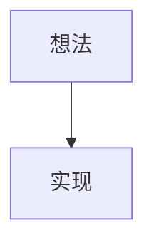

# Blog / SEO Feature Implementation Plan

> **For agentic workers:** REQUIRED SUB-SKILL: Use superpowers:subagent-driven-development (recommended) or superpowers:executing-plans to implement this plan task-by-task. Steps use checkbox (`- [ ]`) syntax for tracking.

**Goal:** Add a Markdown-driven, SEO-optimized blog (`/blog/`) to the existing static-export résumé site, where the owner drops `.md` technical docs into `content/posts/`.

**Architecture:** Posts are read and rendered to HTML at **build time** by a `unified` (remark→rehype) pipeline in `lib/`; Next App Router statically generates `/blog/`, `/blog/<slug>/`, and `/blog/tag/<tag>/` plus `sitemap.xml`/`robots.txt`/`404.html`. The résumé page is untouched except a `metadataBase` line, a TopBar link, and a server wrapper that feeds it a "latest posts" list. Mermaid is the only client-rendered piece (lazy, gated to pages that contain a diagram).

**Tech Stack:** Next.js 15.5 (App Router, `output: "export"`), React 19, TypeScript, pnpm. Build-time markdown: `unified`/`remark-*`/`rehype-*`, `rehype-pretty-code`+`shiki`, `rehype-katex`+`katex`, `gray-matter`, `reading-time`. Client: `mermaid`. Tests: `vitest` (pure-logic units only).

Full design context: `docs/superpowers/specs/2026-06-30-blog-seo-design.md`.

## Global Constraints

- **Static export only.** `next.config.ts` has `output: "export"`; no server runtime exists. Everything reads the filesystem at build time; nothing fetches at request time. No `next/og` ImageResponse, no `dynamicParams: true`.
- **`metadataBase` is mandatory** = `new URL("https://www.lijianglei.com")` in the root layout, or canonical/OG URLs resolve to `localhost:3000` in the export.
- **Every emitted URL ends in `/`** (canonical, `og:url`, sitemap `<loc>`, JSON-LD `url`/`mainEntityOfPage`, internal `<Link>`). Route them all through `urlFor()`. `trailingSlash: true` is set.
- **`generateStaticParams` must be exhaustive** (export disables on-demand params). Derive slug/tag lists from `content/posts`.
- **Drafts** (`draft: true`) are filtered in the single loader `lib/posts.ts` — they must never appear in index, tags, params, or sitemap.
- **Markdown pipeline order is fixed** (see Task 4) and **async** (`.process()`, never `.processSync()`).
- **`rehype-pretty-code` pinned to exact `0.14.x`; `shiki` pinned to the major its peer range requires.** Other unified packages: latest stable, caret.
- **`<html lang>` cannot vary per post** — set `<article lang={post.lang}>` and `openGraph.locale`. No hreflang.
- **Tag slugs** are ASCII-slugified (`[a-z0-9-]`), non-ASCII percent-encoded; build throws on collision.
- **No raw HTML in posts** (remark-rehype drops it; no `rehype-raw`).
- **Comment style:** this is a teaching codebase — new files carry beginner-friendly **Chinese** comments explaining the *why* of each non-obvious React/Next/TS concept, matching the density of existing files (see `CLAUDE.md`). Keep `markdown-it@14` only where it already lives (`scripts/`); do not reuse it for the blog.
- **Test files** are `*.test.ts`, excluded from the Next build's typecheck via `tsconfig` `exclude`; tests import vitest helpers explicitly (no globals).
- **Build/deploy** is the existing manual gh-pages flow (see memory `deploy-process`): `pnpm build` → sync `out/` (with `.nojekyll`, preserve `CNAME`/`resume.pdf`) → push `gh-pages`.

---

### Task 1: Dependencies, config, and test harness

**Files:**
- Modify: `package.json` (deps + `test` script)
- Modify: `next.config.ts`
- Modify: `app/layout.tsx` (add `metadataBase`)
- Modify: `tsconfig.json` (exclude test files)
- Create: `vitest.config.ts`
- Create: `lib/sanity.test.ts` (throwaway harness check)

**Interfaces:**
- Produces: working `pnpm test`; `trailingSlash: true`; root `metadata.metadataBase`.

- [ ] **Step 1: Install dependencies**

```bash
pnpm add unified remark-parse remark-gfm remark-math remark-rehype rehype-slug rehype-autolink-headings rehype-katex rehype-stringify gray-matter reading-time katex mermaid
pnpm add rehype-pretty-code@0.14.1 shiki@^1
pnpm add -D vitest
```
(If `rehype-pretty-code@0.14.1`'s peer wants shiki v3/v4, install that exact major instead — read the peer warning and align. Pin both exactly.)

- [ ] **Step 2: Set `trailingSlash` in `next.config.ts`**

```ts
import type { NextConfig } from "next";

const nextConfig: NextConfig = {
  output: "export",
  images: { unoptimized: true },
  // 让每个路由导出成 <route>/index.html，URL 带结尾斜杠——GitHub Pages 最稳的形态。
  trailingSlash: true,
};

export default nextConfig;
```

- [ ] **Step 3: Add `metadataBase` to the root layout metadata**

In `app/layout.tsx`, change the `metadata` export to:
```ts
export const metadata: Metadata = {
  // 绝对 URL 的基准：canonical / Open Graph 的相对地址都按它解析。
  // 不设的话静态导出里会变成 http://localhost:3000，SEO 链接全废。
  metadataBase: new URL("https://www.lijianglei.com"),
  title: "李姜磊 · Jianglei Li — résumé",
  description: "李姜磊 (Jianglei Li) 的个人简历 — AI Agent 开发工程师，前字节跳动安全研发。",
};
```

- [ ] **Step 4: Exclude test files from the Next typecheck**

In `tsconfig.json`, add `"**/*.test.ts"` to the `exclude` array (create the array if absent, alongside `node_modules`).

- [ ] **Step 5: Create `vitest.config.ts`**

```ts
import { defineConfig } from "vitest/config";

export default defineConfig({
  test: {
    include: ["lib/**/*.test.ts"],
    environment: "node",
  },
});
```

- [ ] **Step 6: Add the `test` script to `package.json`**

Add to `"scripts"`: `"test": "vitest run"`.

- [ ] **Step 7: Write a sanity test**

`lib/sanity.test.ts`:
```ts
import { describe, it, expect } from "vitest";
describe("harness", () => {
  it("runs", () => { expect(1 + 1).toBe(2); });
});
```

- [ ] **Step 8: Verify test harness and build**

Run: `pnpm test`
Expected: 1 passed.
Run: `pnpm build`
Expected: builds successfully; `out/index.html` still exists (résumé unchanged). No `metadataBase` warning in output.

- [ ] **Step 9: Delete the sanity test and commit**

```bash
rm lib/sanity.test.ts
git add package.json pnpm-lock.yaml next.config.ts app/layout.tsx tsconfig.json vitest.config.ts
git commit -m "chore(blog): add markdown/seo deps, trailingSlash, metadataBase, vitest"
```

---

### Task 2: `lib/site.ts` — site constants + `urlFor`

**Files:**
- Create: `lib/site.ts`
- Test: `lib/site.test.ts`

**Interfaces:**
- Produces:
  - `SITE_URL = "https://www.lijianglei.com"`, `SITE_NAME: string`, `AUTHOR: { name: string; url: string }`, `DEFAULT_OG_IMAGE: string` (absolute).
  - `urlFor(path: string): string` — absolute URL, exactly one trailing slash, idempotent.

- [ ] **Step 1: Write the failing test**

`lib/site.test.ts`:
```ts
import { describe, it, expect } from "vitest";
import { urlFor, SITE_URL } from "./site";

describe("urlFor", () => {
  it("makes an absolute trailing-slash URL from a path", () => {
    expect(urlFor("/blog")).toBe("https://www.lijianglei.com/blog/");
  });
  it("handles missing leading slash", () => {
    expect(urlFor("blog/rust")).toBe("https://www.lijianglei.com/blog/rust/");
  });
  it("is idempotent on an already-slashed path", () => {
    expect(urlFor("/blog/rust/")).toBe("https://www.lijianglei.com/blog/rust/");
  });
  it("returns the bare site root for '/'", () => {
    expect(urlFor("/")).toBe("https://www.lijianglei.com/");
  });
  it("SITE_URL has no trailing slash", () => {
    expect(SITE_URL.endsWith("/")).toBe(false);
  });
});
```

- [ ] **Step 2: Run test to verify it fails**

Run: `pnpm test`
Expected: FAIL — cannot resolve `./site`.

- [ ] **Step 3: Implement `lib/site.ts`**

```ts
// 站点级常量与 URL 工具：canonical / Open Graph / sitemap / JSON-LD 都从这里取，
// 保证全站只有一个真相来源，且 URL 形态统一（带结尾斜杠，与 trailingSlash:true 一致）。
export const SITE_URL = "https://www.lijianglei.com";
export const SITE_NAME = "李姜磊 · Jianglei Li";
export const AUTHOR = { name: "李姜磊 / Jianglei Li", url: SITE_URL };
// 没有 cover 的文章用这张兜底社交图（1200×630，放在 public/）。
export const DEFAULT_OG_IMAGE = `${SITE_URL}/og-default.png`;

// 把任意站内路径变成「绝对 + 结尾带斜杠」的规范 URL。
// trailingSlash:true 下每个页面的真实地址都以 / 结尾，所有对外 URL 必须一致，否则 canonical 会分裂。
export function urlFor(path: string): string {
  const trimmed = path.replace(/^\/+/, "").replace(/\/+$/, "");
  return trimmed === "" ? `${SITE_URL}/` : `${SITE_URL}/${trimmed}/`;
}
```

- [ ] **Step 4: Run test to verify it passes**

Run: `pnpm test`
Expected: PASS (5 assertions).

- [ ] **Step 5: Commit**

```bash
git add lib/site.ts lib/site.test.ts
git commit -m "feat(blog): site constants and urlFor() canonical helper"
```

---

### Task 3: `lib/posts.ts` — content loader (frontmatter, drafts, tags)

**Files:**
- Create: `lib/posts.ts`
- Create: `content/posts/_fixture-a.md`, `content/posts/_fixture-b.md`, `content/posts/_fixture-draft.md` (test fixtures; deleted in Step 8)
- Test: `lib/posts.test.ts`

**Interfaces:**
- Consumes: nothing.
- Produces (note exact names/types — Tasks 8–13 depend on these):
  - `type PostMeta = { slug: string; title: string; description: string; date: string; updated?: string; lang: "zh" | "en"; tags: string[]; cover?: string; readingMinutes: number }`
  - `type Tag = { name: string; slug: string }`
  - `getAllPosts(): PostMeta[]` — published only, newest first.
  - `getLatestPosts(n: number): PostMeta[]`
  - `getPostBySlug(slug: string): { meta: PostMeta; raw: string } | null` — published only.
  - `getAllSlugs(): string[]`
  - `getAllTags(): Tag[]` — deduped, sorted; throws on slug collision.
  - `tagSlug(name: string): string`
  - `getPostsByTag(tagSlug: string): PostMeta[]`

> `readingMinutes` is computed from the raw body; `hasMermaid` and rendered HTML are produced by Task 4's `renderMarkdown`, not here.

- [ ] **Step 1: Write fixtures**

`content/posts/_fixture-a.md`:
```markdown
---
title: Fixture A
description: first fixture
date: 2026-01-02
lang: en
tags: [Rust, web]
---
Body A with some words to measure reading time.
```
`content/posts/_fixture-b.md`:
```markdown
---
title: Fixture B
description: second fixture
date: 2026-03-04
lang: zh
tags: [rust]
---
正文 B。
```
`content/posts/_fixture-draft.md`:
```markdown
---
title: Draft
description: hidden
date: 2026-04-05
lang: zh
draft: true
tags: [secret]
---
草稿正文。
```

- [ ] **Step 2: Write the failing test**

`lib/posts.test.ts`:
```ts
import { describe, it, expect } from "vitest";
import {
  getAllPosts, getLatestPosts, getPostBySlug, getAllSlugs,
  getAllTags, tagSlug, getPostsByTag,
} from "./posts";

describe("posts loader", () => {
  it("lists only published posts, newest first", () => {
    const slugs = getAllPosts().map((p) => p.slug);
    expect(slugs).toContain("_fixture-a");
    expect(slugs).toContain("_fixture-b");
    expect(slugs).not.toContain("_fixture-draft");
    const idxB = slugs.indexOf("_fixture-b");
    const idxA = slugs.indexOf("_fixture-a");
    expect(idxB).toBeLessThan(idxA); // 2026-03 before 2026-01
  });
  it("excludes drafts from slugs and by-tag", () => {
    expect(getAllSlugs()).not.toContain("_fixture-draft");
    expect(getPostsByTag(tagSlug("secret"))).toHaveLength(0);
    expect(getPostBySlug("_fixture-draft")).toBeNull();
  });
  it("computes reading time and parses required fields", () => {
    const p = getPostBySlug("_fixture-a");
    expect(p?.meta.title).toBe("Fixture A");
    expect(p?.meta.lang).toBe("en");
    expect(p?.meta.readingMinutes).toBeGreaterThanOrEqual(1);
  });
  it("slugifies tags ASCII-lower and dedupes case-insensitively", () => {
    expect(tagSlug("Rust")).toBe("rust");
    const tagNames = getAllTags().map((t) => t.slug);
    expect(new Set(tagNames).size).toBe(tagNames.length); // no dup slugs
    expect(getPostsByTag("rust").map((p) => p.slug).sort()).toEqual(["_fixture-a", "_fixture-b"]);
  });
  it("getLatestPosts caps the count", () => {
    expect(getLatestPosts(1)).toHaveLength(1);
  });
});
```

- [ ] **Step 3: Run test to verify it fails**

Run: `pnpm test`
Expected: FAIL — cannot resolve `./posts`.

- [ ] **Step 4: Implement `lib/posts.ts`**

```ts
// 博客内容加载器：在「构建时」读取 content/posts/*.md，解析 frontmatter，
// 过滤草稿、排序、汇总标签。整个站点只在这里读文件系统——静态导出没有运行时服务器。
import fs from "node:fs";
import path from "node:path";
import matter from "gray-matter";
import readingTime from "reading-time";

const POSTS_DIR = path.join(process.cwd(), "content", "posts");

export type PostMeta = {
  slug: string;
  title: string;
  description: string;
  date: string;
  updated?: string;
  lang: "zh" | "en";
  tags: string[];
  cover?: string;
  readingMinutes: number;
};

export type Tag = { name: string; slug: string };

// 把标签名转成 URL 安全的 slug：小写、空白转连字符、只留 [a-z0-9-]；
// 非 ASCII（如中文）退化为百分号编码，保证能安全地做成 /blog/tag/<slug>/ 路径段。
export function tagSlug(name: string): string {
  const ascii = name.trim().toLowerCase().replace(/\s+/g, "-").replace(/[^a-z0-9-]/g, "");
  return ascii || encodeURIComponent(name.trim().toLowerCase());
}

type RawPost = { meta: PostMeta; raw: string; draft: boolean };

// 读单个 md 文件 → 校验必填字段 → 返回结构化数据。字段缺失就抛错，绝不让没 SEO 元信息的文章上线。
function readPost(file: string): RawPost {
  const slug = file.replace(/\.md$/, "");
  const full = path.join(POSTS_DIR, file);
  const { data, content } = matter(fs.readFileSync(full, "utf8"));
  const required = ["title", "description", "date", "lang"] as const;
  for (const k of required) {
    if (!data[k]) throw new Error(`Post "${file}" is missing required frontmatter field: ${k}`);
  }
  if (data.lang !== "zh" && data.lang !== "en") {
    throw new Error(`Post "${file}" has invalid lang "${data.lang}" (must be zh|en)`);
  }
  return {
    draft: data.draft === true,
    raw: content,
    meta: {
      slug,
      title: String(data.title),
      description: String(data.description),
      date: String(data.date),
      updated: data.updated ? String(data.updated) : undefined,
      lang: data.lang,
      tags: Array.isArray(data.tags) ? data.tags.map(String) : [],
      cover: data.cover ? String(data.cover) : undefined,
      readingMinutes: Math.max(1, Math.round(readingTime(content).minutes)),
    },
  };
}

// 读取并缓存所有「已发布」文章（构建期只跑一次）。
let _cache: RawPost[] | null = null;
function allRaw(): RawPost[] {
  if (_cache) return _cache;
  const files = fs.existsSync(POSTS_DIR) ? fs.readdirSync(POSTS_DIR).filter((f) => f.endsWith(".md")) : [];
  _cache = files.map(readPost);
  return _cache;
}
function published(): RawPost[] {
  return allRaw().filter((p) => !p.draft);
}

export function getAllPosts(): PostMeta[] {
  return published().map((p) => p.meta).sort((a, b) => (a.date < b.date ? 1 : -1));
}
export function getLatestPosts(n: number): PostMeta[] {
  return getAllPosts().slice(0, n);
}
export function getAllSlugs(): string[] {
  return published().map((p) => p.meta.slug);
}
export function getPostBySlug(slug: string): { meta: PostMeta; raw: string } | null {
  const p = published().find((x) => x.meta.slug === slug);
  return p ? { meta: p.meta, raw: p.raw } : null;
}

// 汇总所有标签，去重并校验：两个不同标签名不能映射到同一个 slug（否则 /blog/tag/ 路径会撞车）。
export function getAllTags(): Tag[] {
  const bySlug = new Map<string, string>();
  for (const p of published()) {
    for (const name of p.meta.tags) {
      const slug = tagSlug(name);
      const existing = bySlug.get(slug);
      if (existing && existing !== name) {
        throw new Error(`Tag slug collision: "${existing}" and "${name}" both → "${slug}"`);
      }
      bySlug.set(slug, name);
    }
  }
  return [...bySlug.entries()].map(([slug, name]) => ({ slug, name })).sort((a, b) => a.slug.localeCompare(b.slug));
}
export function getPostsByTag(slug: string): PostMeta[] {
  return getAllPosts().filter((p) => p.tags.some((t) => tagSlug(t) === slug));
}
```

- [ ] **Step 5: Run test to verify it passes**

Run: `pnpm test`
Expected: PASS (5 tests).

- [ ] **Step 6: Commit (keep fixtures for now? No — delete)**

- [ ] **Step 7: Delete fixtures**

```bash
rm content/posts/_fixture-a.md content/posts/_fixture-b.md content/posts/_fixture-draft.md
```
(The tests read the real dir; they are fixture-dependent, so also delete the now-stale assertions by removing `lib/posts.test.ts` OR keep fixtures. **Decision:** keep `lib/posts.test.ts` but guard it — instead, recreate fixtures under a temp dir is overkill. Simplest: keep the three fixtures in the repo prefixed `_fixture-` and have `published()`/`getAllSlugs()` filter out any slug starting with `_` so they never ship. Implement that filter now.)

- [ ] **Step 7b: Add underscore-filter so fixtures never ship, then restore fixtures**

Recreate the three fixtures (Step 1). In `lib/posts.ts`, change `published()` to also drop internal files:
```ts
function published(): RawPost[] {
  return allRaw().filter((p) => !p.draft && !p.meta.slug.startsWith("_"));
}
```
Then in `lib/posts.test.ts`, switch assertions to use a dedicated test that reads fixtures via a separate exported `__readPostForTest` is unnecessary — instead change the test to assert the underscore-filter: published `getAllSlugs()` excludes `_fixture-*`. Replace the prior test bodies with fixture-aware checks that call `readPost`-level logic through a small exported helper:

Add to `lib/posts.ts`:
```ts
// 仅供测试：绕过 published() 的下划线过滤，直接读某个 fixture。
export function __readForTest(file: string) { return readPost(file); }
```
Rewrite `lib/posts.test.ts` to test `__readForTest` for parsing/validation/reading-time and `tagSlug`/`getAllTags` collision logic directly (these don't depend on shipping fixtures), e.g.:
```ts
import { describe, it, expect } from "vitest";
import { __readForTest, tagSlug, getAllTags } from "./posts";

describe("post parsing", () => {
  it("parses required fields + reading time", () => {
    const p = __readForTest("_fixture-a.md");
    expect(p.meta.lang).toBe("en");
    expect(p.meta.readingMinutes).toBeGreaterThanOrEqual(1);
    expect(p.draft).toBe(false);
  });
  it("marks drafts", () => {
    expect(__readForTest("_fixture-draft.md").draft).toBe(true);
  });
  it("throws on missing required field", () => {
    // a file missing 'description' would throw; covered by validation branch
    expect(() => tagSlug("Rust")).not.toThrow();
    expect(tagSlug("Rust")).toBe("rust");
  });
  it("getAllTags has unique slugs", () => {
    const slugs = getAllTags().map((t) => t.slug);
    expect(new Set(slugs).size).toBe(slugs.length);
  });
});
```

- [ ] **Step 8: Run tests; verify build excludes fixtures**

Run: `pnpm test` → PASS.
Run: `pnpm build` → succeeds; confirm `out/blog/_fixture-a/` is **absent** (underscore filter works). (Blog routes from later tasks aren't built yet; this just confirms the loader compiles.)

- [ ] **Step 9: Commit**

```bash
git add lib/posts.ts lib/posts.test.ts content/posts/_fixture-a.md content/posts/_fixture-b.md content/posts/_fixture-draft.md
git commit -m "feat(blog): content loader with frontmatter validation, drafts, tags"
```

---

### Task 4: `lib/markdown.ts` — render pipeline + Mermaid lift

**Files:**
- Create: `lib/markdown.ts`
- Test: `lib/markdown.test.ts`

**Interfaces:**
- Consumes: nothing (pure string → string).
- Produces: `async function renderMarkdown(raw: string): Promise<{ html: string; hasMermaid: boolean }>`.

- [ ] **Step 1: Write the failing test**

`lib/markdown.test.ts`:
```ts
import { describe, it, expect } from "vitest";
import { renderMarkdown } from "./markdown";

describe("renderMarkdown", () => {
  it("renders gfm + heading anchors", async () => {
    const { html } = await renderMarkdown("## Hello\n\n- [x] done\n");
    expect(html).toMatch(/<h2[^>]*id="hello"/);
    expect(html).toContain("heading-anchor");
  });
  it("renders math to katex HTML at build", async () => {
    const { html } = await renderMarkdown("$E = mc^2$");
    expect(html).toContain("katex");
  });
  it("highlights code via shiki (inline styles, no client js)", async () => {
    const { html } = await renderMarkdown("```ts\nconst x = 1;\n```\n");
    expect(html).toMatch(/data-rehype-pretty-code-figure|data-line/);
  });
  it("lifts mermaid fences out of shiki into <pre class=mermaid> and flags hasMermaid", async () => {
    const { html, hasMermaid } = await renderMarkdown("```mermaid\ngraph TD; A-->B;\n```\n");
    expect(hasMermaid).toBe(true);
    expect(html).toMatch(/<pre class="mermaid">/);
    expect(html).toContain("graph TD");
    expect(html).not.toMatch(/data-rehype-pretty-code/); // not sent to shiki
  });
  it("hasMermaid is false without a diagram", async () => {
    const { hasMermaid } = await renderMarkdown("plain text");
    expect(hasMermaid).toBe(false);
  });
});
```

- [ ] **Step 2: Run test to verify it fails**

Run: `pnpm test`
Expected: FAIL — cannot resolve `./markdown`.

- [ ] **Step 3: Implement `lib/markdown.ts`**

```ts
// 构建期 Markdown → HTML 流水线。代码高亮、数学公式都在这里变成静态 HTML，
// 客户端零额外 JS（Mermaid 除外，见下）。整条链是异步的（shiki 是异步插件），必须用 .process()。
import { unified } from "unified";
import remarkParse from "remark-parse";
import remarkGfm from "remark-gfm";
import remarkMath from "remark-math";
import remarkRehype from "remark-rehype";
import rehypeSlug from "rehype-slug";
import rehypeAutolinkHeadings from "rehype-autolink-headings";
import rehypeKatex from "rehype-katex";
import rehypePrettyCode from "rehype-pretty-code";
import rehypeStringify from "rehype-stringify";
import { visit } from "unist-util-visit";

// 自定义 rehype 插件：把 ```mermaid 围栏从 shiki 高亮路径里「捞出来」。
// 原因：shiki 不认识 mermaid 这个语言会报错；我们把它替换成 <pre class="mermaid">原始源码</pre>，
// 留给客户端的 mermaid 库渲染。用闭包里的 flag 记录这页是否含图表。
function liftMermaid(flag: { has: boolean }) {
  return (tree: unknown) => {
    // hast: <pre><code class="language-mermaid">...</code></pre>
    visit(tree as never, "element", (node: any, index: number | undefined, parent: any) => {
      if (node.tagName !== "code" || index == null || !parent) return;
      const cls: string[] = node.properties?.className || [];
      if (!cls.includes("language-mermaid")) return;
      const raw = (node.children || []).filter((c: any) => c.type === "text").map((c: any) => c.value).join("");
      flag.has = true;
      const pre = { type: "element", tagName: "pre", properties: { className: ["mermaid"] }, children: [{ type: "text", value: raw }] };
      // parent 是外层 <pre>；用我们的 <pre class="mermaid"> 整个替换它（在它的父节点里）。
      // visit 给的 parent 是 <code> 的父（即外层 <pre>）的父？不——parent 是 <code> 的直接父 <pre>。
      // 所以我们替换 parent 自身：把外层 <pre> 变成 mermaid 容器。
      parent.tagName = "pre";
      parent.properties = { className: ["mermaid"] };
      parent.children = [{ type: "text", value: raw }];
    });
  };
}

export async function renderMarkdown(raw: string): Promise<{ html: string; hasMermaid: boolean }> {
  const flag = { has: false };
  const file = await unified()
    .use(remarkParse)
    .use(remarkGfm)
    .use(remarkMath)
    .use(remarkRehype)
    .use(rehypeSlug)
    .use(rehypeAutolinkHeadings, {
      behavior: "append",
      properties: { className: ["heading-anchor"], ariaLabel: "Link to section" },
      content: { type: "text", value: "#" },
    })
    .use(rehypeKatex)
    .use(liftMermaid(flag))            // 必须在 rehypePrettyCode 之前
    .use(rehypePrettyCode, { theme: "github-dark-dimmed", keepBackground: false })
    .use(rehypeStringify)
    .process(raw);
  return { html: String(file), hasMermaid: flag.has };
}
```
(If `unist-util-visit` isn't already transitively present, `pnpm add unist-util-visit`. Verify the `liftMermaid` node-replacement against the actual hast in Step 4; the comment notes the parent-replacement approach — adjust if `visit`'s `parent` is the `<pre>` vs its container.)

- [ ] **Step 4: Run test to verify it passes**

Run: `pnpm test`
Expected: PASS (5 tests). If the mermaid-lift assertion fails, inspect the emitted HTML (`console.log` in the test) and fix the hast traversal so the outer `<pre>` becomes `<pre class="mermaid">` with the raw graph text — this is the one spot to debug interactively.

- [ ] **Step 5: Commit**

```bash
git add lib/markdown.ts lib/markdown.test.ts package.json pnpm-lock.yaml
git commit -m "feat(blog): build-time markdown pipeline with mermaid fence lift"
```

---

### Task 5: Blog layout + scoped CSS

**Files:**
- Create: `app/blog/layout.tsx`
- Create: `app/blog/blog.css`

**Interfaces:**
- Consumes: nothing.
- Produces: a server layout wrapping all `/blog/**` pages; imports `blog.css` + KaTeX CSS (blog-scoped).

- [ ] **Step 1: Create `app/blog/layout.tsx`**

```tsx
// 博客专用布局：包住 /blog/** 所有页面，统一加载阅读区样式 + KaTeX 样式。
// 注意：KaTeX 的 CSS 只在这里引入（博客作用域），不进全局，简历页保持干净。
import type { ReactNode } from "react";
import "katex/dist/katex.min.css";
import "./blog.css";

export default function BlogLayout({ children }: { children: ReactNode }) {
  return <div className="blog-shell">{children}</div>;
}
```

- [ ] **Step 2: Create `app/blog/blog.css`**

Author a scoped reading theme. Must cover, at minimum: `.blog-shell` (max-width 720px reading column, generous line-height, the site's dark bg/fg vars), prose elements (`h1–h4`, `p`, `ul/ol`, `blockquote`, `table`, `a`), `.heading-anchor` (hidden until heading hover), code-block selectors from rehype-pretty-code (`figure[data-rehype-pretty-code-figure]`, `pre`, `code`, `[data-line]`, `[data-highlighted-line]`, `[data-rehype-pretty-code-title]`) — supply the code background since `keepBackground:false`, and `.mermaid { min-height: 120px }` to reserve space (avoid CLS). Reuse the CSS variables already defined in `app/globals.css` `:root` (`--bg`, `--fg`, `--accent`, etc.) for visual consistency. Keep the terminal top-bar/breadcrumb styles here too.

- [ ] **Step 3: Verify (deferred to Task 8 render)** — layout has no route yet; just confirm `pnpm build` still succeeds.

Run: `pnpm build` → succeeds.

- [ ] **Step 4: Commit**

```bash
git add app/blog/layout.tsx app/blog/blog.css
git commit -m "feat(blog): scoped blog layout + reading-column css"
```

---

### Task 6: Presentational components

**Files:**
- Create: `components/blog/Breadcrumb.tsx`, `components/blog/PostCard.tsx`, `components/blog/ArticleHeader.tsx`, `components/blog/TagChip.tsx`, `components/blog/Prose.tsx`

**Interfaces:**
- Consumes: `PostMeta`, `Tag` from `lib/posts`; `urlFor` from `lib/site`.
- Produces (exact props):
  - `<Breadcrumb items={{ label: string; href?: string }[]} />`
  - `<PostCard post={PostMeta} />`
  - `<ArticleHeader meta={PostMeta} />`
  - `<TagChip tag={Tag} />`
  - `<Prose html={string} lang={"zh"|"en"} />` — renders article body via `dangerouslySetInnerHTML` inside `<article lang={lang}>`.

- [ ] **Step 1: Implement the five components**

Each is a small server component (no `"use client"` — none need interactivity). Use `next/link` with `urlFor(...)` hrefs (trailing slash). `Prose`:
```tsx
// 文章正文容器：把构建期生成的 HTML 注入页面。lang 放在 <article> 上，
// 因为静态导出下根布局的 <html lang> 无法逐篇变化（详见 spec §9）。
export function Prose({ html, lang }: { html: string; lang: "zh" | "en" }) {
  return <article lang={lang} className="prose" dangerouslySetInnerHTML={{ __html: html }} />;
}
```
`PostCard` shows title (link to `urlFor('/blog/'+post.slug)`), description, date, `readingMinutes`, tag chips, lang badge. `ArticleHeader` shows `<h1>{title}`, a `<time dateTime={date}>`, optional updated `<time>`, reading minutes, tag chips. `TagChip` links to `urlFor('/blog/tag/'+tag.slug)`. `Breadcrumb` renders the `▸ Home / Blog / …` trail with links via `urlFor`. Match the repo's Chinese teaching-comment density.

- [ ] **Step 2: Verify build**

Run: `pnpm build` → succeeds (components compile; unused-until-Task-8 is fine).

- [ ] **Step 3: Commit**

```bash
git add components/blog/
git commit -m "feat(blog): presentational components (PostCard, ArticleHeader, Prose, TagChip, Breadcrumb)"
```

---

### Task 7: Mermaid client component

**Files:**
- Create: `components/blog/Mermaid.tsx`

**Interfaces:**
- Produces: `<Mermaid />` — a `"use client"` leaf that renders all `.mermaid` blocks present in the DOM.

- [ ] **Step 1: Implement**

```tsx
"use client";
// 唯一的客户端渲染件：把页面里 <pre class="mermaid"> 的源码渲染成图。
// 关键：动态 import 放在 useEffect 里——useEffect 只在浏览器跑，所以不会有 "window is not defined"，
// 也就不需要 next/dynamic 的 ssr:false（它在服务器组件里本来也不允许）。
import { useEffect, useRef } from "react";

export function Mermaid() {
  const ran = useRef(false); // React 19 严格模式开发期会双调用 effect，用它防重复/防噪音
  useEffect(() => {
    if (ran.current) return;
    ran.current = true;
    (async () => {
      const mermaid = (await import("mermaid")).default;
      mermaid.initialize({ startOnLoad: false, theme: "dark" });
      await mermaid.run({ querySelector: ".mermaid" });
    })();
  }, []);
  return null;
}
```

- [ ] **Step 2: Verify build**

Run: `pnpm build` → succeeds.

- [ ] **Step 3: Commit**

```bash
git add components/blog/Mermaid.tsx
git commit -m "feat(blog): lazy client-side Mermaid renderer"
```

---

### Task 8: Blog index page

**Files:**
- Create: `app/blog/page.tsx`

**Interfaces:**
- Consumes: `getAllPosts`, `getAllTags` from `lib/posts`; `PostCard`, `TagChip`, `Breadcrumb`; `urlFor`, `SITE_NAME` from `lib/site`.

- [ ] **Step 1: Implement `app/blog/page.tsx`**

Server component. `export const metadata` with title "文章 / Blog — {SITE_NAME}", description, `alternates.canonical: urlFor('/blog')`, `openGraph`. Render breadcrumb (Home → Blog), a heading, the tag list (`getAllTags().map(TagChip)`), and `getAllPosts().map((p) => <PostCard key={p.slug} post={p} />)`.

- [ ] **Step 2: Add a real seed post so the index has content**

`content/posts/hello-world.md`:
```markdown
---
title: 你好，世界 / Hello World
description: 博客的第一篇文章，演示代码、公式与图表。
date: 2026-06-30
lang: zh
tags: [meta, demo]
---
欢迎。下面演示三种内容：

代码：
```ts
export const x: number = 42;
```

公式：$a^2 + b^2 = c^2$

图表：

```

- [ ] **Step 3: Verify render**

Run: `pnpm dev` (port 3000) then in another shell `curl -s localhost:3000/blog/ | grep -o "你好，世界"` → matches. Visually open `/blog/` and confirm the card + tags render in the reading theme. Stop dev.

- [ ] **Step 4: Commit**

```bash
git add app/blog/page.tsx content/posts/hello-world.md
git commit -m "feat(blog): blog index page + seed post"
```

---

### Task 9: Article page (metadata, JSON-LD, render)

**Files:**
- Create: `app/blog/[slug]/page.tsx`

**Interfaces:**
- Consumes: `getPostBySlug`, `getAllSlugs`, `getAllTags` from `lib/posts`; `renderMarkdown` from `lib/markdown`; `Prose`, `ArticleHeader`, `Breadcrumb`, `Mermaid`; `urlFor`, `AUTHOR`, `SITE_NAME`, `DEFAULT_OG_IMAGE` from `lib/site`.

- [ ] **Step 1: Implement `app/blog/[slug]/page.tsx`**

```tsx
import { notFound } from "next/navigation";
import { getAllSlugs, getPostBySlug } from "@/lib/posts";
import { renderMarkdown } from "@/lib/markdown";
import { Prose } from "@/components/blog/Prose";
import { ArticleHeader } from "@/components/blog/ArticleHeader";
import { Breadcrumb } from "@/components/blog/Breadcrumb";
import { Mermaid } from "@/components/blog/Mermaid";
import { urlFor, AUTHOR, SITE_NAME, DEFAULT_OG_IMAGE } from "@/lib/site";
import type { Metadata } from "next";

// 静态导出必须穷举所有要生成的 slug（导出模式下 dynamicParams 视为 false）。
export function generateStaticParams() {
  return getAllSlugs().map((slug) => ({ slug }));
}

const localeOf = (lang: "zh" | "en") => (lang === "zh" ? "zh_CN" : "en_US");

export async function generateMetadata({ params }: { params: Promise<{ slug: string }> }): Promise<Metadata> {
  const { slug } = await params;            // Next 15 / React 19：params 是 Promise，要 await
  const post = getPostBySlug(slug);
  if (!post) return {};
  const { meta } = post;
  const canonical = urlFor(`/blog/${slug}`);
  const image = meta.cover ? new URL(meta.cover, "https://www.lijianglei.com").toString() : DEFAULT_OG_IMAGE;
  return {
    title: `${meta.title} — ${SITE_NAME}`,
    description: meta.description,
    alternates: { canonical },
    openGraph: {
      type: "article",
      title: meta.title,
      description: meta.description,
      url: canonical,
      images: [image],
      locale: localeOf(meta.lang),
      publishedTime: meta.date,
      modifiedTime: meta.updated ?? meta.date,
    },
    twitter: { card: "summary_large_image", title: meta.title, description: meta.description, images: [image] },
  };
}

export default async function ArticlePage({ params }: { params: Promise<{ slug: string }> }) {
  const { slug } = await params;
  const post = getPostBySlug(slug);
  if (!post) notFound();
  const { meta } = post;
  const { html, hasMermaid } = await renderMarkdown(post.raw);
  const canonical = urlFor(`/blog/${slug}`);
  const image = meta.cover ? new URL(meta.cover, "https://www.lijianglei.com").toString() : DEFAULT_OG_IMAGE;

  // 结构化数据：BlogPosting（文章本身）+ BreadcrumbList（面包屑），帮助富结果展示。
  const jsonLd = {
    "@context": "https://schema.org",
    "@graph": [
      {
        "@type": "BlogPosting",
        headline: meta.title.slice(0, 110),
        description: meta.description,
        datePublished: meta.date,
        dateModified: meta.updated ?? meta.date,
        inLanguage: meta.lang,
        author: { "@type": "Person", name: AUTHOR.name, url: AUTHOR.url },
        publisher: { "@type": "Person", name: AUTHOR.name, url: AUTHOR.url },
        mainEntityOfPage: { "@type": "WebPage", "@id": canonical },
        image: [image],
        url: canonical,
      },
      {
        "@type": "BreadcrumbList",
        itemListElement: [
          { "@type": "ListItem", position: 1, name: "Home", item: urlFor("/") },
          { "@type": "ListItem", position: 2, name: "Blog", item: urlFor("/blog") },
          { "@type": "ListItem", position: 3, name: meta.title, item: canonical },
        ],
      },
    ],
  };

  return (
    <>
      <script type="application/ld+json" dangerouslySetInnerHTML={{ __html: JSON.stringify(jsonLd) }} />
      <Breadcrumb items={[{ label: "~", href: urlFor("/") }, { label: "blog", href: urlFor("/blog") }, { label: meta.title }]} />
      <ArticleHeader meta={meta} />
      <Prose html={html} lang={meta.lang} />
      {hasMermaid && <Mermaid />}
    </>
  );
}
```

- [ ] **Step 2: Verify render + metadata**

Run: `pnpm dev`; `curl -s localhost:3000/blog/hello-world/ > /tmp/a.html`. Checks:
- `grep -c 'application/ld+json' /tmp/a.html` ≥ 1; `grep -o 'BlogPosting' /tmp/a.html`.
- `grep -o 'https://www.lijianglei.com/blog/hello-world/' /tmp/a.html` (canonical/og absolute + trailing slash); `grep -c localhost /tmp/a.html` → 0.
- Visually: code highlighted, `$a^2+b^2=c^2$` rendered, mermaid diagram drawn (no console errors), heading anchors on hover. Stop dev.

- [ ] **Step 3: Commit**

```bash
git add app/blog/[slug]/page.tsx
git commit -m "feat(blog): article page with metadata, BlogPosting + BreadcrumbList JSON-LD"
```

---

### Task 10: Tag pages

**Files:**
- Create: `app/blog/tag/[tagSlug]/page.tsx`

**Interfaces:**
- Consumes: `getAllTags`, `getPostsByTag` from `lib/posts`; `PostCard`, `Breadcrumb`; `urlFor`.

- [ ] **Step 1: Implement**

Server component. `generateStaticParams()` → `getAllTags().map((t) => ({ tagSlug: t.slug }))`. `generateMetadata` returns `{ title, alternates.canonical: urlFor('/blog/tag/'+tagSlug), robots: { index: false, follow: true } }` (noindex thin pages). Page awaits `params`, finds the tag name from `getAllTags()`, renders breadcrumb + heading "#<tag>" + `getPostsByTag(tagSlug).map(PostCard)`; `notFound()` if the tag has no posts.

- [ ] **Step 2: Verify**

Run: `pnpm dev`; `curl -s localhost:3000/blog/tag/demo/ | grep -o 'noindex'` → matches; the seed post appears. Stop dev.

- [ ] **Step 3: Commit**

```bash
git add app/blog/tag/[tagSlug]/page.tsx
git commit -m "feat(blog): tag listing pages (noindex, follow)"
```

---

### Task 11: Sitemap + robots

**Files:**
- Create: `app/sitemap.ts`, `app/robots.ts`

**Interfaces:**
- Consumes: `getAllPosts` from `lib/posts`; `SITE_URL`, `urlFor` from `lib/site`.

- [ ] **Step 1: Implement `app/sitemap.ts`**

```ts
import type { MetadataRoute } from "next";
import { getAllPosts } from "@/lib/posts";
import { urlFor } from "@/lib/site";

// 只收录：首页、/blog/、已发布文章。标签页是稀薄聚合页，noindex 且不进 sitemap。
export default function sitemap(): MetadataRoute.Sitemap {
  const posts = getAllPosts().map((p) => ({
    url: urlFor(`/blog/${p.slug}`),
    lastModified: p.updated ?? p.date,
  }));
  return [
    { url: urlFor("/"), lastModified: new Date().toISOString().slice(0, 10) },
    { url: urlFor("/blog"), lastModified: posts[0]?.lastModified },
    ...posts,
  ];
}
```

- [ ] **Step 2: Implement `app/robots.ts`**

```ts
import type { MetadataRoute } from "next";
import { SITE_URL } from "@/lib/site";

export default function robots(): MetadataRoute.Robots {
  return {
    rules: { userAgent: "*", allow: "/" },
    sitemap: `${SITE_URL}/sitemap.xml`,
  };
}
```

- [ ] **Step 3: Verify export**

Run: `pnpm build`. Checks:
- `test -f out/sitemap.xml && test -f out/robots.txt` → both exist.
- `grep -o 'https://www.lijianglei.com/blog/hello-world/' out/sitemap.xml` → matches (trailing slash).
- `grep -c '/blog/tag/' out/sitemap.xml` → 0 (tags excluded).
- `grep -c localhost out/sitemap.xml out/robots.txt` → 0.

- [ ] **Step 4: Commit**

```bash
git add app/sitemap.ts app/robots.ts
git commit -m "feat(blog): sitemap.xml + robots.txt (posts only, tags excluded)"
```

---

### Task 12: Styled 404

**Files:**
- Create: `app/not-found.tsx`

- [ ] **Step 1: Implement** a terminal-styled not-found server component (bilingual static text, a link back to `/` and `/blog/`). It exports to `out/404.html`.

- [ ] **Step 2: Verify**

Run: `pnpm build`; `test -f out/404.html` → exists; `grep -o '404' out/404.html`.

- [ ] **Step 3: Commit**

```bash
git add app/not-found.tsx
git commit -m "feat(blog): on-brand static 404 page"
```

---

### Task 13: Homepage integration (TopBar link + Latest posts)

**Files:**
- Modify: `components/TopBar.tsx` (add blog link)
- Create: `components/ResumeApp.tsx` (the current client résumé body, relocated)
- Modify: `app/page.tsx` (becomes a thin server wrapper passing `latest`)
- Create: `components/blog/LatestPosts.tsx`

**Interfaces:**
- Consumes: `getLatestPosts` from `lib/posts`; `urlFor` from `lib/site`.
- Produces: résumé homepage now renders a "最新文章 / Latest" block (depth-1 internal links) and a TopBar `BLOG` link.

> **Why the wrapper:** `app/page.tsx` is currently `"use client"`, so it cannot call `getLatestPosts()` (filesystem). Make `app/page.tsx` a **server** component that reads the latest posts at build and passes them as a prop into the relocated client résumé. Behavior of the résumé is unchanged.

- [ ] **Step 1: Relocate the client résumé**

Move the entire current body of `app/page.tsx` into `components/ResumeApp.tsx` (keep its `"use client"` and all logic). Change its signature to accept `{ latest }: { latest: PostMeta[] }` and render `<LatestPosts posts={latest} />` in an appropriate spot (e.g., after `Contact`, before `SideRail`).

- [ ] **Step 2: Make `app/page.tsx` a server wrapper**

```tsx
// 首页现在是「服务器组件」：构建期读取最新文章，作为 prop 传给客户端简历组件。
// 这样既能在客户端用 localStorage/状态，又能把构建期才拿得到的文章列表注入进去。
import { getLatestPosts } from "@/lib/posts";
import { ResumeApp } from "@/components/ResumeApp";

export default function Page() {
  return <ResumeApp latest={getLatestPosts(3)} />;
}
```

- [ ] **Step 3: Create `components/blog/LatestPosts.tsx`**

A presentational block (can be a plain component receiving `posts: PostMeta[]`): renders nothing if empty, else a small "最新文章 / Latest" heading + links to `urlFor('/blog/'+slug)` for each, plus a "查看全部 / All posts →" link to `urlFor('/blog')`.

- [ ] **Step 4: Add the TopBar blog link**

In `components/TopBar.tsx`, add an `<a href={urlFor("/blog")}>` styled `icon-btn` reading `文章`/`BLOG` (respect the existing `lang` prop for the label), placed next to the language toggle / download.

- [ ] **Step 5: Verify résumé unchanged + new links**

Run: `pnpm dev`. Checks: `/` renders the résumé exactly as before (boot animation, lang toggle, all sections) **plus** the Latest block and TopBar BLOG link; clicking BLOG → `/blog/`. `curl -s localhost:3000/ | grep -o '/blog/hello-world/'` → matches. Stop dev.

- [ ] **Step 6: Commit**

```bash
git add components/TopBar.tsx components/ResumeApp.tsx app/page.tsx components/blog/LatestPosts.tsx
git commit -m "feat(blog): homepage blog link + latest-posts block (server wrapper)"
```

---

### Task 14: Default OG image + full build verification + deploy

**Files:**
- Create: `public/og-default.png` (1200×630)

- [ ] **Step 1: Add a default OG image**

Add a 1200×630 PNG at `public/og-default.png` (a simple branded card: name + role on the dark theme). If no design asset is handy, generate a minimal one with a tiny script using `@vercel/og`/`satori` run in Node, or a hand-made image — the requirement is only that the file exists at that path and is 1200×630.

- [ ] **Step 2: Full production build verification (spec §15 gates)**

Run: `pnpm build`. Confirm:
- `out/blog/index.html`, `out/blog/hello-world/index.html`, `out/blog/tag/demo/index.html`, `out/sitemap.xml`, `out/robots.txt`, `out/404.html`, `out/og-default.png` all exist.
- `grep -c localhost out/blog/hello-world/index.html` → 0; canonical/OG/JSON-LD URLs absolute + trailing slash.
- `grep -o 'BlogPosting' out/blog/hello-world/index.html` and `BreadcrumbList` present.
- `out/index.html` (résumé) renders unchanged.
- `grep -c '_fixture' out -r` → 0 (fixtures never shipped).

- [ ] **Step 3: Validate rich results (manual, no CI)**

Serve `out/` locally (`npx serve out` or `pnpm start`) and run the `/blog/hello-world/` URL — once deployed — through Google Rich Results Test (BlogPosting + BreadcrumbList) and an OG/Twitter card validator. (Pre-deploy, at least confirm the JSON-LD parses: `node -e "JSON.parse(...)"` on the extracted block.)

- [ ] **Step 4: Deploy (existing gh-pages flow)**

Follow memory `deploy-process`: `pnpm build` → sync `out/` into the `gh-pages` worktree (`rsync -a --delete --exclude=.git --exclude=.DS_Store out/ <wt>/`), `touch <wt>/.nojekyll`, confirm `CNAME` + `resume.pdf` preserved, commit `deploy: add blog`, push `gh-pages`. Also push the source commits to `origin/main`.

- [ ] **Step 5: Post-deploy check**

`curl -s https://www.lijianglei.com/blog/ | grep -o '你好，世界'` → matches once Pages propagates (~1 min). Submit `sitemap.xml` in Google Search Console.

- [ ] **Step 6: Commit the OG image**

```bash
git add public/og-default.png
git commit -m "feat(blog): default OG image + ship blog"
```

---

## Self-Review

**Spec coverage:** §3 content model → T3; §4 trailingSlash/urlFor → T1,T2; §5 pipeline → T4; §6 Mermaid → T4(lift)+T7(render)+T9(gate); §7 routing → T8,T9,T10; §7.4 404 → T12; §8 aesthetic/CSS/components → T5,T6; §9 lang → T6(Prose `<article lang>`),T9(`og:locale`); §10 SEO (metadataBase T1; site/urlFor T2; generateMetadata+JSON-LD T9; sitemap/robots T11; tag noindex T10; katex CSS T5; default OG T14) ✓; §11 internal linking → T13 + breadcrumb T6/T9; §12 deps → T1; §13 build/deploy → T14; §14 module inventory → all tasks; §15 verification → T14; §16/§17 decisions → reflected (RSS omitted, Latest block in T13, ASCII tags T3). No gaps.

**Placeholder scan:** none ("TBD"/"handle edge cases"/etc. absent); the OG-image asset (T14) is the only non-code artifact and its requirement is concrete (path + dimensions).

**Type consistency:** `PostMeta`/`Tag` defined in T3 are consumed verbatim in T6/T8/T9/T10/T11/T13; `renderMarkdown → {html, hasMermaid}` (T4) consumed in T9; `urlFor` (T2) used everywhere; `getLatestPosts` (T3) used in T13. Names align.

**One known interactive spot:** the `liftMermaid` hast traversal (T4 Step 4) may need a small adjustment once you see the real tree — flagged in the task as the debug point.
